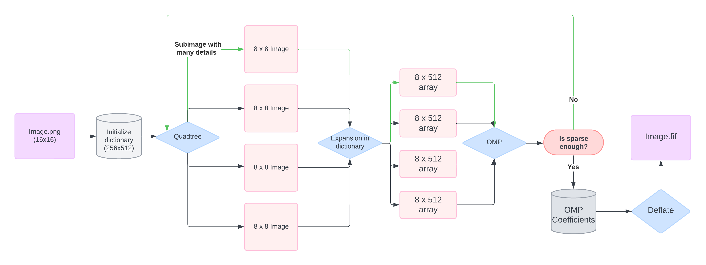

# Adaptive Quadtree Refinement and Matching Pursuit
Código para Adaptive Quadtree Refinement and Matching Pursuit (AQMP)

# Roadmap:

- [x] Compare with JPEG Algorithm
- [ ] Fix dicctionary product with subimages
- [ ] Print or show different compression levels
- [ ] Check alternative dictionaries
   - [ ] Adaptive dictionaries: DCT or wavelet bases, K-means clustering-based dictionary.
   - [ ] Non-orthogonal basis functions: Gabor wavelets or curvelets.
- [ ] Test different compression levels with sparsity parameter.
- [ ] Implement DEFLATE function from zlib to see check if there are changes in the SSIM index.
- [ ] Extend to video compressive sensing (2nd paper?) [https://www.mdpi.com/2076-3417/12/5/2734]

# Example Diagram:

